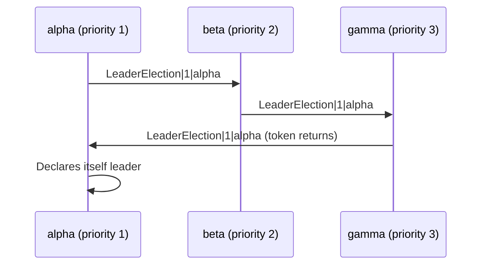

# **Distributed Key-Value Store with LCR Leader Election**

[](https://golang.org)
[](LICENSE)
[]()

A lightweight distributed key-value datastore that synchronizes updates
across nodes using TCP and elects a leader using the **classic LCR
(LeLann--Chang--Roberts)** ring election algorithm.

This project demonstrates: - Distributed messaging over TCP\
- Ring-based leader election\
- Config-driven peer topology\
- Synchronized write/delete operations\
- A simple REST API for interacting with the store

Perfect for learning or extending into a more robust distributed system.

------------------------------------------------------------------------

# **📌 Features**

### 🔁 **LCR Ring Leader Election**

-   Nodes forward the highest-priority UID around the ring.
-   When a candidate sees its own UID return → it becomes leader.
-   Fully deterministic ring built from `config.yml`.

### 🗃 **Distributed Key-Value Store**

-   REST API for PUT / GET / DELETE
-   All writes/deletes are propagated instantly via TCP
-   Simple and deterministic replication model

### 🩺 **Heartbeat Monitoring**

-   Each node runs a heartbeat service to detect connectivity.

### ⚙️ **Config-Driven Architecture**

All peer details, priorities, and ports live in a single YAML file.

------------------------------------------------------------------------

# **📂 Project Layout**

    .
    ├── main.go             # Core distributed system logic
    ├── config.yml          # Node ports, ring order, priorities
    ├── go.mod
    ├── startup.sh          # Launch 3 local nodes for testing
    └── README.md

------------------------------------------------------------------------

# **🧩 How It Works**

## **1. Startup Sequence**

Each node: 1. Loads `config.yml` 2. Determines its neighbors in the ring
(sorted by priority) 3. Opens: - Heartbeat listener - Data listener -
REST API 4. Connects to peers 5. Starts LCR leader election

## **2. LCR Leader Election (Diagram)**



Lower number = higher priority.

## **3. Write Replication**

REST call triggers:

    POST /kv/key

Node broadcasts message:

    Write|len(key)|key|len(value)|value

All peers apply it immediately.

------------------------------------------------------------------------

# **⚙️ Configuration (`config.yml`)**

``` yaml
peers:
  alpha:
    - "127.0.0.1:5001"   # heartbeat port
    - "127.0.0.1:6001"   # data port
  beta:
    - "127.0.0.1:5002"
    - "127.0.0.1:6002"
  gamma:
    - "127.0.0.1:5003"
    - "127.0.0.1:6003"

rest:
  alpha: ":7001"
  beta:  ":7002"
  gamma: ":7003"

priority:
  alpha: 1
  beta:  2
  gamma: 3
```

------------------------------------------------------------------------

# **🚀 Running the System Locally**

## **Option A --- Use the startup script (recommended)**

``` sh
chmod +x startup.sh
./startup.sh
```

This launches:

  Node    REST   Heartbeat   Data
  ------- ------ ----------- ------
  alpha   7001   5001        6001
  beta    7002   5002        6002
  gamma   7003   5003        6003

------------------------------------------------------------------------

## **Option B --- Run nodes manually**

    go run . alpha
    go run . beta
    go run . gamma

------------------------------------------------------------------------

# **🧪 Testing the System**

## **1. Insert a value**

``` sh
curl -X POST http://localhost:7001/kv/mykey      -H "Content-Type: application/json"      -d '{"value":"hello"}'
```

## **2. Read from any node**

``` sh
curl http://localhost:7003/kv/mykey
```

Returns:

    hello

## **3. Delete a key**

``` sh
curl -X DELETE http://localhost:7002/kv/mykey
```

------------------------------------------------------------------------

# **🧠 Leader Election Logs**

Example:

    alpha sent election token to beta: LeaderElection|1|alpha
    beta forwards token to gamma
    gamma forwards token to alpha
    ✔ alpha is leader (priority 1)

------------------------------------------------------------------------

# **⚠️ Limitations**

-   No message framing (TCP may group/split packets).
-   No fault tolerance for failed nodes.
-   Leader election does not rebroadcast winner.
-   All nodes must start for ring to be complete.
-   No persistence (in-memory only).

Planned improvements: - Length-prefixed TCP framing - Automatic
re-election on failure - WAL + persistence - Node discovery & dynamic
membership

------------------------------------------------------------------------

# **📜 License**

MIT License --- free for personal and commercial use.

------------------------------------------------------------------------

# **🙌 Contributing**

PRs welcome!\
Open issues, suggest improvements, or request features.
